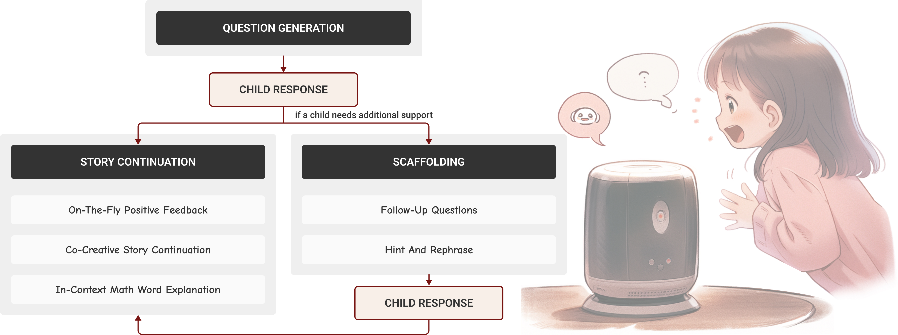

# Mathemyths: Leveraging Large Language Models to Teach Mathematical Language through Child-AI Co-Creative Storytelling

[**Link to CHI 2024 Paper**](https://doi.org/10.1145/3613904.3642647)

Mathematical language is a cornerstone of a child's mathematical development, and children can effectively acquire this language through storytelling with a knowledgeable and engaging partner. In this study, we leverage the recent advances in large language models to conduct free-form, creative conversations with children. Consequently, we developed Mathemyths, a joint storytelling agent that takes turns co-creating stories with children while integrating mathematical terms into the evolving narrative. This paper details our development process, illustrating how prompt-engineering can optimize LLMs for educational contexts. Through a user study involving 35 children aged 4-8 years, our results suggest that when children interacted with Mathemyths, their learning of mathematical language was comparable to those who co-created stories with a human partner. However, we observed differences in how children engaged with co-creation partners of different natures. Overall, we believe that LLM applications, like Mathemyths, offer children a unique conversational experience pertaining to focused learning objectives.



## Setup
1. Create a new virtual environment

   ```bash
   $ conda create -n storytelling python
   $ conda activate storytelling
   ```

2. Install the requirements

   ```bash
   $ conda install --yes --file requirements.txt
   ```

3. Run the app

   ```bash
   $ sudo python main.py --text # Mac OS
   $ python main.py --text # Windows
   ```

4. Pack the app into a single executable file

   ```bash
   $ pyinstaller --onefile main.py
   ```

<!-- ## Todo-List

- [x] text chat
- [x] speech to text
- [x] text to speech
- [x] save chat log
- [x] exception handling
- [x] replace pyttsx3 with other tts APIs for better voice quality -->

## CHI 2024 Paper

**Mathemyths: Leveraging Large Language Models to Teach Mathematical Language through Child-AI Co-Creative Storytelling**<br />
Chao Zhang*, Xuechen Liu, Katherine Ziska, Soobin Jeon, Chi-Lin Yu, Ying Xu _(\* This work was carried out when the author was a visiting researcher at the University of Michigan.)_

**Please cite this paper if you used the code or prompts in this repository.**

> Chao Zhang, Xuechen Liu, Katherine Ziska, Soobin Jeon, Chi-Lin Yu, and Ying Xu. 2024. Mathemyths: Leveraging Large Language Models to Teach Mathematical Language through Child-AI Co-Creative Storytelling. In Proceedings of the CHI Conference on Human Factors in Computing Systems (CHI '24). Association for Computing Machinery, New York, NY, USA, Article 274, 1–23. https://doi.org/10.1145/3613904.3642647

```bibtex
@inproceedings{10.1145/3613904.3642647,
   author = {Zhang, Chao and Liu, Xuechen and Ziska, Katherine and Jeon, Soobin and Yu, Chi-Lin and Xu, Ying},
   title = {Mathemyths: Leveraging Large Language Models to Teach Mathematical Language through Child-AI Co-Creative Storytelling},
   year = {2024},
   isbn = {9798400703300},
   publisher = {Association for Computing Machinery},
   address = {New York, NY, USA},
   url = {https://doi-org.proxy.library.cornell.edu/10.1145/3613904.3642647},
   doi = {10.1145/3613904.3642647},
   booktitle = {Proceedings of the CHI Conference on Human Factors in Computing Systems},
   articleno = {274},
   numpages = {23},
   keywords = {Storytelling, child–AI collaboration, children, co-creativity, conversational interfaces, large language models, mathematical language},
   location = {Honolulu, HI, USA},
   series = {CHI '24}
}
```

## Acknowledgements

This paper is supported by the National Science Foundation under Grant No. 2302730. We thank the children who participated in our study and our local public libraries for graciously offering space for us to recruit participants and carry out the study. We also thank the research assistants at the University of Michigan for their assistance with data collection and analysis.
